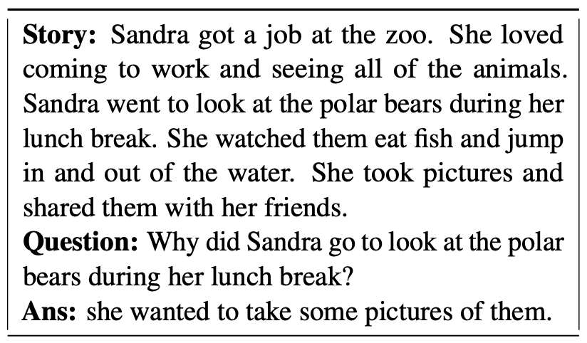

# TellMeWhy: A Dataset for Answering Why-Questions in Narratives

TellMeWhy is a large-scale crowdsourced dataset made up of more than **30k questions and free-form answers** concerning why characters in short narratives perform the actions described.
Since a question can have many valid answers, we also release an easy-to-use **human evaluation suite** that should be used to correctly evaluate models for this why question answering task.
Our paper "TellMeWhy: A Dataset for Answering Why-Questions in Narratives" published in Findings of [ACL-IJCNLP 2021](https://2021.aclweb.org).
The camera ready version is available on ArXiv [here](https://arxiv.org/abs/2106.06132).
The Anthology version is available [here](https://aclanthology.org/2021.findings-acl.53/).
It can also be found [here](TellMeWhy.pdf).
The video for the ACL Findings talk can be found [here](https://www.youtube.com/watch?v=vl5KnITgx34) and the slides are [here](TellMeWhy-Slides.pdf).
This work was also presented in a poster session at the [GEM workshop](https://gem-benchmark.com/workshop) at ACL-IJCNLP 2021.

<p align="center">
  
</p>

## Dataset Information

| Split | # Stories | # Questions |
|  :--: |  :---:    |   :---:     |
| Train | 7,558     | 23,964      |
| Val   | 944       | 2,992       |
| Test  | 944       | 3,099       |
| ----- | --------- | ----------- |
| Annotated Test | 190 | 464      |
| ----- | --------- | ----------- |
| Total | 9,636     | 30,519      |

The test and annotated split are exclusive and combined together to form test_full.
The dataset can be downloaded in [JSON](https://drive.google.com/file/d/13eZfq0PuvQug7A25OnyRbfjf9eYuGW5s/view?usp=sharing) format or in [CSV](https://drive.google.com/file/d/1FHKVMmbfh25M64mXVRD8Tb6gYCliKWi2/view?usp=sharing) format.
The test data to submit to the leaderboard can be downloaded in CSV format from [here](https://drive.google.com/file/d/14hqA7TdDmt42WOb-gNV5JnsW2g_u0-UI/view?usp=sharing).

The downloaded folder contains the following files:
```
data
 ├── train
 ├── val
 ├── test_full
 └── test_caters_subset
```

The train and val files contain the training set and dev set respectively. 
The test_full file contains the full test set, which is used to report automatic metrics (like BLEU, BLEURT etc). 
The test_annotated file contains a small subset of test data for which grammaticality and validity human judgments are available, and this is used to conduct standard human evaluation for models.

Both csv and json files contain the same information described below:
 - question_meta - unique ID for each question
 - narrative - Full story
 - question - Question related to the story
 - answer - One (out of three) answers for that question
 - is_ques_answerable_annotator - One (out of three) annotator judgment whether answer to the question is available in the story
 - is_ques_answerable - Majority judgment about whether answer to the question is available in the story
 - narrative_lexical_overlap - Lexical overlap of answer with story (0 to 1)
 - original_sentence_for_question - Sentence in story from which question was created
 - original_narrative_form - Narrative as a list of sentences
 - helpful_sentences - annotator judgment as to which sentence in the narrative helped them answer the question (1-indexed)
 - gram_ann - if available, this contains 3 annotator judgments about the grammaticality of the answer on a Likert scale (-2 to 2)
 - val_ann - if available, this contains 3 annotator judgments about the validity of the answer on a Likert scale (-2 to 2)

**The dataset is also available on HuggingFace [here](https://huggingface.co/datasets/StonyBrookNLP/tellmewhy).**
To load it, you can use the following code snippet:
```python
from datasets import load_dataset

tellmewhy = load_dataset('StonyBrookNLP/tellmewhy')
```
If you use the version from HuggingFace, please carefully read the instructions on the dataset card about how to evaluate your model on our dataset.

**TellMeWhy is also part of the BIG-Bench benchmark.**

## Task & Evaluation

This dataset was primarily built to advance research into answering why questions in narratives.
We benchmarked the dataset by fine-tuning pretrained models to answer these questions as a generative task.
Since there can be any number of valid answers to a question, we propose a consistent evaluation task for the same.
Three annotators are asked to rate the grammaticality and validity (whether the provided answer is a plausible answer for the question) on a 5 point Likert scale.
We release the requisite templates and scripts so that the community can evaluate their work consistently.
Please see the `src/` directory on the [GitHub repository](https://github.com/StonyBrookNLP/tellmewhy) for further details.

### Benchmark Models

We finetune large pretrained language models to see if they are capable enough to answer why questions about narratives.
We consider grammaticality and validity, determined by human annotators, to be the correct way to evaluate performance on this task.

|                     | Grammaticality | Validity |
|     :---:           |     :---:      |  :---:   |
| Human               |     99.07%     |  95.47%  |
| Finetuned T5        |     98.06%     |  54.53%  |
| Finetuned UnifiedQA |     100%       |  56.25%  |

For implicit answer questions (2 out of 3 annotators agree that answer is not in story), we find that model performance decreases significantly.
This shows that they are unable to read between the lines and rely on explicitly stated information to answer such questions.

|                     | Grammaticality | Validity |
|     :---:           |     :---:      |  :---:   |
| Human               |     99.07%     |  94.06%  |
| Finetuned T5        |     98.06%     |  28.03%  |
| Finetuned UnifiedQA |     100%       |  33.12%  |

High inter-annotator agreement (using weighted Fleiss Kappa) shows the reliability of the evaluation.

## Building the Dataset

### Motivation

Answering questions about why characters perform certain actions is central to understanding and reasoning about narratives. 
Despite recent progress in QA, it is not clear if existing models have the ability to answer “why” questions that may require commonsense knowledge external to the input narrative.
We have created a dataset of why questions that ask for causal explanations for actions performed in a story.
Answering these questions requires an understanding of the events that are explicit in the story as well as access to implicit commonsense knowledge on how people use actions as parts of plans to achieve goals.

### Generating Why Questions

We focus on the ROCStories corpus [(Mostafazadeh et al, 2016)](https://www.aclweb.org/anthology/N16-1098/).
We parse each sentence in each story using SpaCy [(Honnibal et al, 2020)](https://github.com/explosion/spaCy).
Considering verbs as actions, we use the generated parse tree to rephrase the sentence into a question about the described action.
This generates ~113k questions.
We randomly select 32,165 questions from stories which had at least 3 questions.

### Crowdsourcing Answers

Annotators were presented a story and 3 why questions related to it.
They were asked to write free form answers to each question.
For each question, they were also asked to provide judgments about the comprehensibility of the question, and whether the narrative explicitly contained the answer. 
They were also asked to select the sentences from the narrative which influenced their answer, if available.
To avoid variability in answer prefixes, we provide a prompt to start answering the question. 
We rephrase the sentence from which the question was generated to create these prompts.

### Validating Answers

For a small subset, we conducted another round of crowdsourcing the answers by the first set of crowd-workers.
This was done on 464 questions, related to the 190 stories that are part of ROCStories as well as CATERS.
Annotators are presented a story, a related question, and the three answers that were collected for in the previous round of crowdsourcing.
Three new annotators then rated the grammaticality and validity (whether the provided answer is a plausible answer for the question) on a 5 point Likert scale.
We found high inter-annotator agreement (using weighted Fleiss Kappa) for both grammaticality and validity of the crowdsourced answers.
For each question, if at least 2 out of 3 annotators agree that the answer to the question is unavailable explicitly in the text, we label it as an implicit-answer question.

## Citation

Please use the following BibTex entry to cite our work.
We will update this when the formal proceedings are published.

```
@inproceedings{lal-etal-2021-tellmewhy,
    title = "{T}ell{M}e{W}hy: A Dataset for Answering Why-Questions in Narratives",
    author = "Lal, Yash Kumar  and
      Chambers, Nathanael  and
      Mooney, Raymond  and
      Balasubramanian, Niranjan",
    booktitle = "Findings of the Association for Computational Linguistics: ACL-IJCNLP 2021",
    month = aug,
    year = "2021",
    address = "Online",
    publisher = "Association for Computational Linguistics",
    url = "https://aclanthology.org/2021.findings-acl.53",
    doi = "10.18653/v1/2021.findings-acl.53",
    pages = "596--610",
}
```

## Contributors

[Yash Kumar Lal](https://www3.cs.stonybrook.edu/~ylal/), [Nate Chambers](https://www.usna.edu/Users/cs/nchamber/), [Raymond Mooney](https://www.cs.utexas.edu/~mooney/), [Niranjan Balasubramanian](https://www3.cs.stonybrook.edu/~niranjan/)
